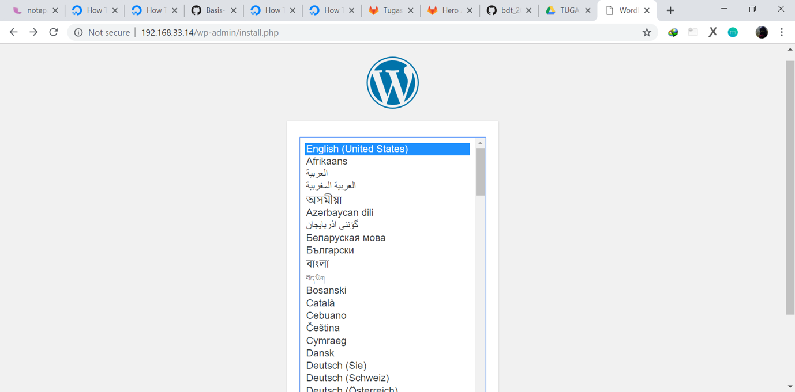

# Implementasi Wordpress pada MySQL Cluster dan ProxySQL
## Berikut ini Arsitektur dan pembagian IP yang digunakan pada mysql-cluster



## Membuat user dan database wordpress
Langkah awalnya masuk ke clusterdb1
`````
  vagrant ssh clusterdb1
  mysql -u root -p (dimana password disesuaikan dengan yang kita inginkan)
`````


Kemudian langkah selanjutnya yaitu masuk ke proxy untuk menambahkan user
`````
  vagrant ssh proxy
  mysql -u admin -p -h 127.0.0.1 -P 6032 --prompt='ProxySQLAdmin> '
`````
## Instalasi Apache2, PHP, dan Wordpress
Masuk ke proxy
`````
  vagrant ssh proxy
`````
## Install Apache dan PHP
`````
  sudo apt-get install apache2
  sudo apt-get install php -y
  sudo apt-get install php-mysql
  sudo apt-get install -y php-gd php-imap php-ldap php-odbc php-pear php-xml php-xmlrpc php-mbstring php-snmp php-soap php-tidy curl
`````
## Install Wordpress
  ### Membuat direktori baru pada direktori /var/www/html/
`````
  mkdir wordpress
`````
  ### Setelah itu masuk ke dalam direktori baru yang telah dibuat
`````
  wget -c http://wordpress.org/latest.tar.gz
  tar -xzvf latest.tar.gz 
`````
  ### Mengubah database ENGINE menjadi NDB
  ### copy schema.php ke file vagrant untuk memudahkan dalam mengedit ENGIEN=NDB
`````
  cp /var/www/html/wordpress/wp-admin/includes/schema.php /vagrant
`````
  ### Setelah di copy, maka file schema tadi di edit dan ditambahkan ENGINE=NDB disetiap labelnya
  
  
  
  ### Kemudian schema.php di copy kembali ke dalam direktori var/www/html/wordpress/wp-admin/includes/
  ### Setelah itu mengedit isi dari wp-config-sample.php  sesuai dengan database dan user yang telah dibuat
`````
  sudo nano wp-config-sample.php
`````
  ### Setelah itu melakukan rename file wp-config-sample.php menjadi wp-config.php
  ## Selanjutnya menjalankan IP 192.168.33.14/wordpress pada browser (untuk menjalankan wordpress)
  Maka akan menmampilkan seperti gambar dibawah ini : 
  
   
   
  Registrasi terlebih dahulu
  
   
   
  Ketika berhasil melakukan registrasi maka akan muncul tampilan seperti dibawah ini : 
  
   
   
  Untuk login wordpress disesuaikan dengan nama yang telah dilakukan awal pertama registrasi
    
   
   
  Berikut ini juga tampilan dari wordpress, dan terlihat jelas hasil post yang telah di tambahkan
     
   
   
   ## Cara untuk mengetahui bahwa post yang kita tambahkan masuk atau berjalan aktif
`````
  masuk ke my sql -u root -p
  kemudian select * from wp_posts\G
`````
  
  
  
   
 ### Berikut ini cara mengetahui apakah database sudah terhubung oleh wordpress pada salah satu node
`````
  vagrant ssh clusterdb2
  mysql -u userwordpress -p -h 192.168.33.14 -P 6033
  show databases;
  use wordpress;
`````
   
   
   
   
   ## Test Database pada wordpress pada cLusterdb 1 dan cluster db2
   #### cek status ndb pada salah satu node ( dibawah ini saya cek pada clusterdb1 )
`````
  ndb_mgm
  show
`````
  ## Selanjutnya mengnonatifkan salah satu node
  
`````
  sudo systemctl stop mysql
`````
   
   
  ### Melakukan pengukuran response time (load test) menggunakan JMeter.
  
   


  
  
  
  
 
 
  
