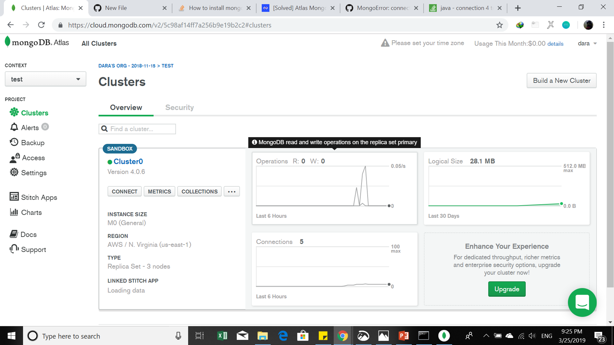
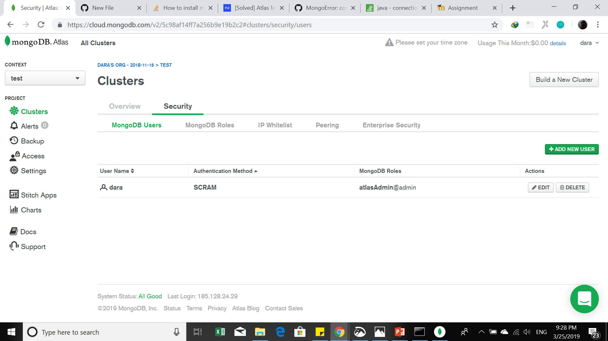
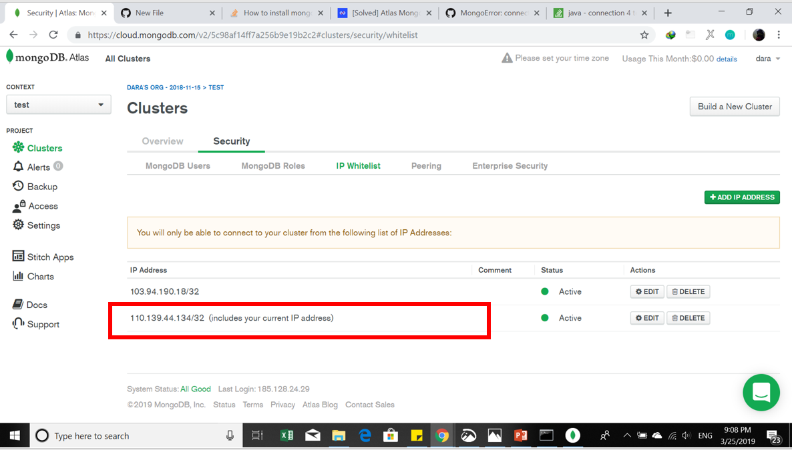
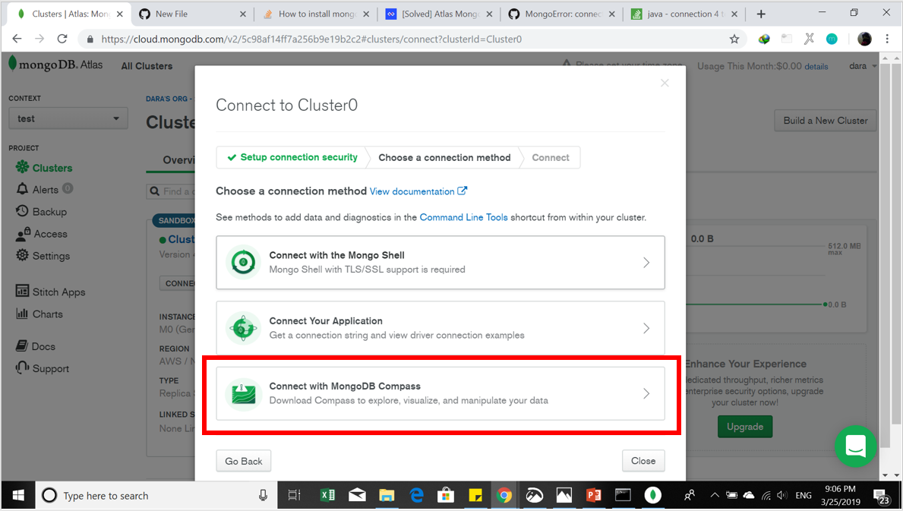
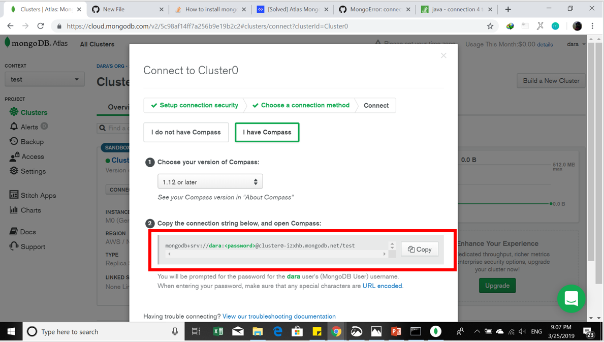

# Implementasi MongoDB
### Langkah-langkah yang harus dilakukan terlebih dahulu untuk membuat MongoDB yaitu : 
#### 1. Melakukan Instalasi MongoDB dan MongoDB Compas
#### 2. Untuk mendownload aplikasi tersebut dapat di download pada situs website https://www.mongodb.com/download-center/community?jmp=docs (Mongo DB) dan https://www.mongodb.com/download-center/compass (MongoDB Compas)
#### 3. Sebelum melakukan instalasi MongoDB, harus melakukan registrasi pada website MongoDB (https://www.mongodb.com/)
#### 4. Setelah melakukan registrasi maka selanjutnya pembuatan cluster pada mongodb, dimana tiap langkah-langkah sangat jelas di arahkan ketika akan membuat cluster
   ##### Hasil tampilan ketika cluster telah terbentuk 
  

#### 5. Membuat user untuk database 
   #####  Hasil tampilan ketika user berhasil dibentuk
 

#### 6. Melakukan settingan IP Whitelist
   ##### Hasil tampilan ketika IP Whitelist telah ditambahkan
    

#### 7. Setelah itu menyambungkan cluster ( melakukan conncet dari cluster ke MongoDB Compas)
  ##### Tampilan untuk melakukan connect cluster dari MongoDB server ke MongoDB Compas
  ##### Jangan lupa untuk mengcopy string yang akan di salin ke MongoDB Compas
                 

