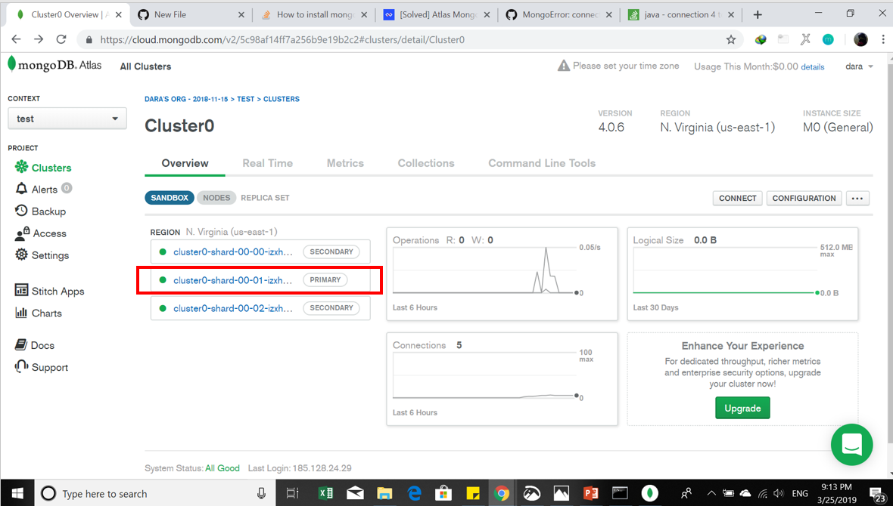

# Implementasi MongoDB
### Langkah-langkah yang harus dilakukan terlebih dahulu untuk membuat MongoDB yaitu : 
#### 1. Melakukan Instalasi MongoDB dan MongoDB Compas
#### 2. Untuk mendownload aplikasi tersebut dapat di download pada situs website https://www.mongodb.com/download-center/community?jmp=docs (Mongo DB) dan https://www.mongodb.com/download-center/compass (MongoDB Compas)
#### 3. Sebelum melakukan instalasi MongoDB, harus melakukan registrasi pada website MongoDB (https://www.mongodb.com/)
#### 4. Setelah melakukan registrasi maka selanjutnya pembuatan cluster pada mongodb, dimana tiap langkah-langkah sangat jelas di arahkan ketika akan membuat cluster
   ##### Hasil tampilan ketika cluster telah terbentuk 
  

#### 5. Membuat user untuk database 
   #####  Hasil tampilan ketika user berhasil dibentuk
 

#### 6. Melakukan settingan IP Whitelist
   ##### Hasil tampilan ketika IP Whitelist telah ditambahkan
    

#### 7. Setelah itu menyambungkan cluster ( melakukan conncet dari cluster ke MongoDB Compas)
  ##### Tampilan untuk melakukan connect cluster dari MongoDB server ke MongoDB Compas
  ##### Jangan lupa untuk mengcopy string yang akan di salin ke MongoDB Compas
                 

#### 8. Cluster telah tersambung ke MongoDB Compas
 ##### Tampilan ketika cluster telah berhasil ke MongoDB Compas
 

#### 9. Selanjutnya melakukan Import file.json pada cmd didalam file mongodb yag telah diinstall
   ##### Dataset yang saya gunakan yaitu recipes.json di ambil dari https://www.kaggle.com
   ##### Cluster yang dipilih adalah yang primary
   ##### Jangan lupa juga memperhatikan replicaSet parameter's value
`````
mongoimport --host cluster0-shard-00-01-izxhb.mongodb.net:27017 --db recipes --type json --file D:\recipes.json --jsonArray --authenticationDatabase admin --ssl --username dara --password dara
   `````
 
 
 
 
 
  
 
 
#### 10. Dataset berhasil di import akan menampilkan gambar seperti dibawah ini
  
 
#### 11. Setelah dataset berhasil di import maka MongoDB Compas menampilkan seperti gambar dibawah ini:
  
 
#### Ketika saya melakukan import dataset terjadi eror yaitu "connect failed" seperti yang saya tampilkan dibawah ini:
  
 
Ternayata penyebabnya yaitu karena akses wifi atau internet yang digunakan tidak sama. 
Solusinya dengan cara menambah alamat IP Whitelist baru.
##### Pada IP Whitelist ini awalnya terdapat satu alamat IP, karena tiap mengakses MongoDB Compas atau MongoDB tidak selalu pada jaringan akses wifi atau internet yang sama , maka menambah alamat IP baru
 

# Referensi
  https://www.mongodb.com/cloud/atlas
