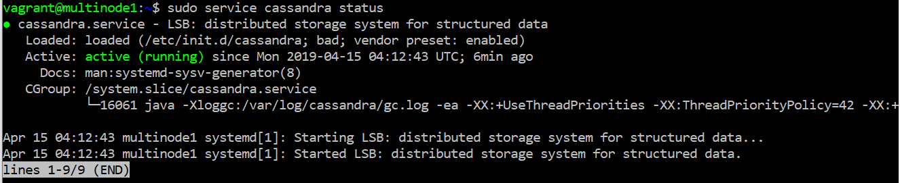
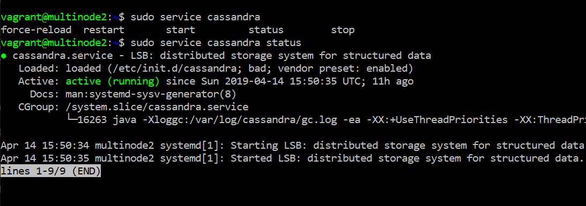
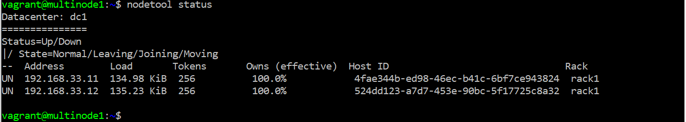
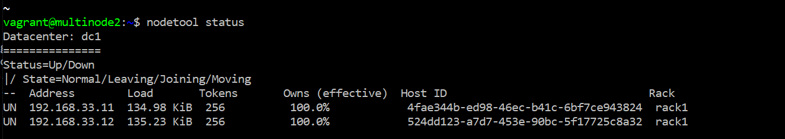
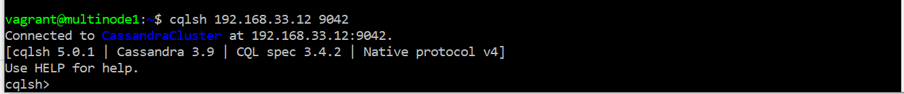

## Implementasi Cassandra dengan menggunakan Multi-Node
#### Pada tahap awal menentukan node, dimana pada Multi-Node saya menggunakanan dua node yaitu : 
  


#### Selanjutnya membuat Vagrantfile, dimana isi Vagrantfile sebagai berikut:
`````
Vagrant.configure("2") do |config|
  (1..2).each do |i|
    config.vm.define "multinode#{i}" do |node|
      node.vm.hostname = "multinode#{i}"
      node.vm.box = "ubuntu/xenial64"
      node.vm.network "private_network", ip: "192.168.33.1#{i}"

      # Opsional. Edit sesuai dengan nama network adapter di komputer
      # node.vm.network "public_network", bridge: "Intel(R) Dual Band Wireless-AC 3165"
      
      node.vm.provider "virtualbox" do |vb|
        vb.name = "multinode#{i}"
        vb.gui = false
        vb.memory = "1024"
      end

      # node.vm.provision "shell", path: "bootstrap.sh", privileged: false
    end
  end
end
`````
#### Install Firewall
Pada tahap ini, install Firewall pada masing-masing node (multinode1 dan multinode2)
`````
sudo apt-get update
sudo apt-get install iptables-persistent
`````
setelah install, maka semua konfigurasi firewall berada pada `````/etc/iptables/rules.v4````` jika menggunakan IPv4 dan `````/etc/iptables/rules.v6````` jika menggunakan IPv6.

#### Setelah itu masing-masing node melakukan install cassandra
Berikut ini tampilan multinode1 berhasil terinstall cassandra


Berikut ini tampilan multinode2 berhasil terinstall cassandra


#### Menghapus data default
Sebelum menghapus data pada masing-masing node, maka hal yang perlu dilakukan terlebih dahulu yaitu mematikan masing-masing node.
Dapat mengikuti petunjuk dibawah ini : 
`````
sudo service cassandra stop
sudo rm -rf /var/lib/cassandra/data/system/*
`````
#### Konfigurasi Cassandra yaml
Hal yang harus dilakukan untuk tahap ini yaitu, mengubah dari beberapa bagian yang terdapat pada `````etc/cassandra.yaml````` dengan membuka direktori `````sudo nano /etc/cassandra/cassandra.yaml````` . Bagian-bagian yang harus diubah sebagai berikut : 
`````
.....
cluster_name: 'CassandraCluster' #Nama Cluster anda, harus sama pada masing-masing node
.....
seed_provider:
  - class_name: org.apache.cassandra.locator.SimpleSeedProvider
    parameters:
         #ip node 1,ip node 2, dan seterusnya jika ada
         - seeds: "192.168.33.11,192.168.33.12"
.....
listen_address: 192.168.33.11 #ip node yang sedang dijalankan
.....
rpc_address: 192.168.33.11 #ip node yang sedang dijalankan
.....
endpoint_snitch: GossipingPropertyFileSnitch
`````
#### Kemudian menjalankan kembali Cassandra
`````
sudo service cassandra start
sudo nodetool status
`````



#### Terakhir kedua node (multinode1 dan multinode2 dapat diakses oleh server 1 maupun server 2)
`````
cqlsh <ip-node> 9042
`````
Maka hasil ouput sebagai berikut : 



## Referensi
### 1. https://www.digitalocean.com/community/tutorials/how-to-install-cassandra-and-run-a-single-node-cluster-on-ubuntu-14-04
### 2. https://github.com/ahmadkikok/bdt_2019/tree/master/tugas_4_cassandara-single-and-multiple-note/tugas_single-note
### 3. https://www.digitalocean.com/community/tutorials/how-to-implement-a-basic-firewall-template-with-iptables-on-ubuntu-14-04
### 4. https://www.digitalocean.com/community/tutorials/how-to-run-a-multi-node-cluster-database-with-cassandra-on-ubuntu-14-04
 


