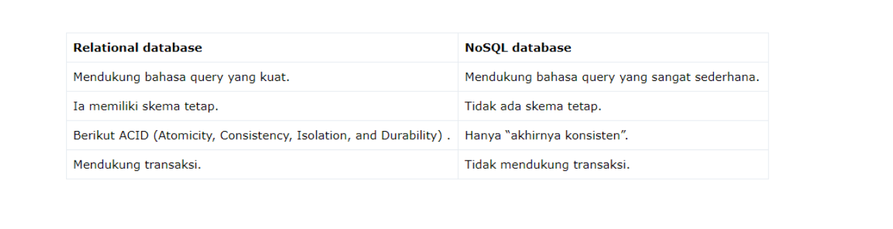
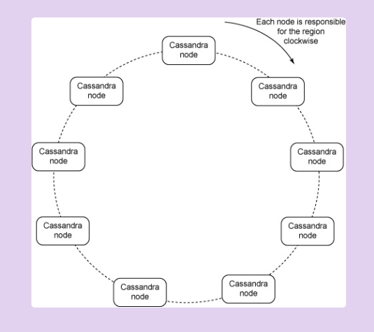
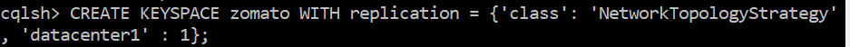
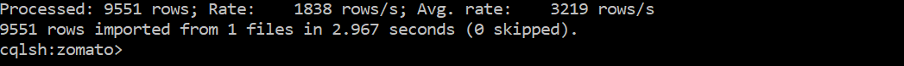
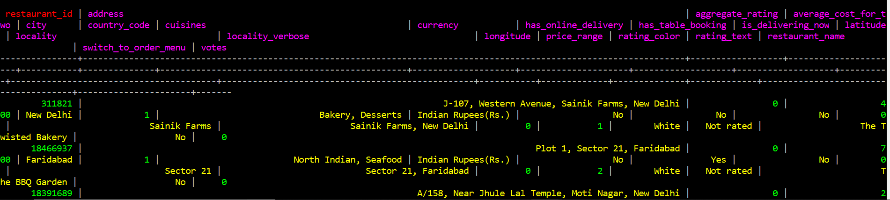
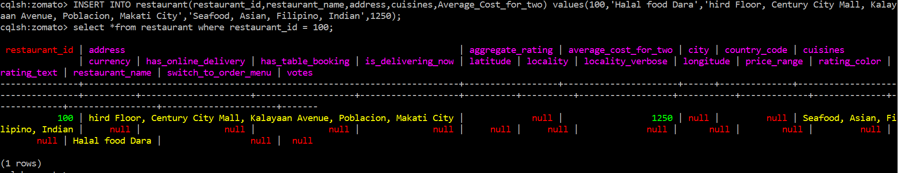
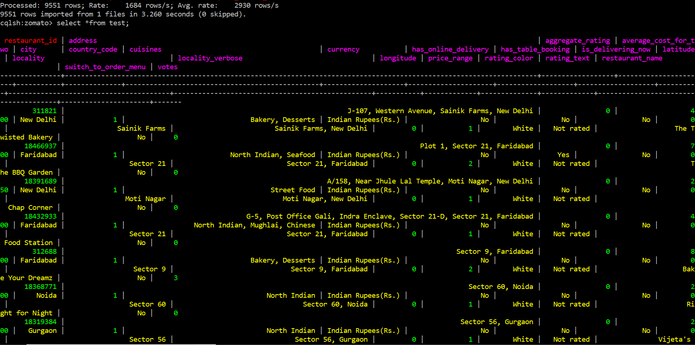
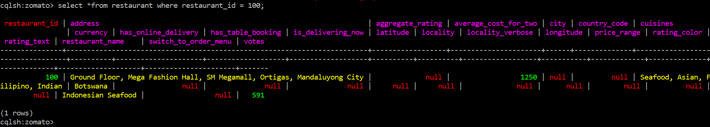
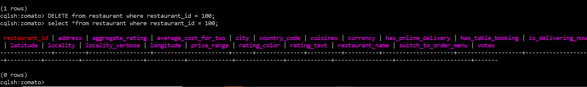

## Implementasi Instalasi Cassandra Single Node & Operasi CRUD 
### Pengertian Cassandra
Cassandra atau lengkap APACHE CASSANDRA adalah salah satu produk open source untuk menajemen database yang didistribusikan oleh Apache yang sangat scalable (dapat diukur) dan dirancang untuk mengelola data terstruktur yang berkapasitas sangat besar (Big Data) yang tersebar di banyak server. Cassandra merupakan salah satu implementasi dari NoSQL (Not Only SQL) seperti mongoDB. NoSQL merupakan konsep penyimpanan database dinamis yang tidak terikat pada relasi-relasi tabel yang kaku seperti RDBMS. Selain lebih scalable, NoSQL juga memiliki performa pengaksesan yang lebih cepat. 

### Perbedaan Antara Relational Database dan NoSQL Database :


### Arsitektur Cassandra



#### Penjelasan mengenai arsitektur : 
1. Apache Cassandra mendistribusikan data antar node secara transparan kepada pengguna. Setiap node dapat menerima permintaan (membaca, menulis, atau menghapus) dan rute ke node yang benar bahkan jika data tidak disimpan dalam simpul tersebut.
2. Pengguna dapat menentukan berapa banyak replika yang dibutuhkan, dan Apache Cassandra menangani penciptaan replika dan manajemen dengan transparan.
3. Konsistensi: Ketika menyimpan dan membaca data, pengguna dapat memilih tingkat konsistensi yang diharapkan per setiap operasi. Misalnya, jika “quorum” tingkat konsistensi digunakan saat menulis atau membaca, data ditulis dan dibaca dari lebih dari setengah dari node di klaster, maka dengan konsistensi yang ditawarkan Apache Cassandra memungkinkan pengguna untuk memilih tingkat konsistensi yang paling cocok untuk kasus penggunaan.
4. Apache Cassandra menyediakan layanan menulis sangat cepat, dan sebenarnya lebih cepat daripada membaca dengan kemampuan transfer data antara 80-360MB/sec per node.

### Proses Instalasi
#### Pada tahap ini saya memakai Single Node, yaitu dengan ip host : 


#### Tahap berikutnya membuat Vagrantfile

`````
Vagrant.configure("2") do |config|
  config.vm.define "cassandra1" do |cassandra1|
    cassandra1.vm.hostname = "cassandra1"
    cassandra1.vm.box = "ubuntu/xenial64"
    cassandra1.vm.network "private_network", ip: "192.168.33.9"

      # Opsional. Edit sesuai dengan nama network adapter di komputer
      # node.vm.network "public_network", bridge: "Intel(R) Dual Band Wireless-AC 3165"
      
    cassandra1.vm.provider "virtualbox" do |vb|
      vb.name = "cassandra1"
      vb.gui = false
      vb.memory = "1024"
    end

    # cassandra.vm.provision "shell", path: "provision/bootstrap.sh", privileged: false
  end
end

`````

### Pastikan kembali bahwa node telah terinstall Cassandra, sama seperti sebelumnya 
[link ke step installasi cassandra single node](https://github.com/daratursina/BDT/blob/master/TUGAS4/Single-Node/README.md/)

### CRUD dan DATASETS
##### Pada tugas ini dataset yang saya gunakan yaitu mengenai zomato-restaurant yang berasal dari [kaggle](https://www.kaggle.com/) >[dataset zomato-restaurant](https://www.kaggle.com/shrutimehta/zomato-restaurants-data/)


### Import Dataset
#### Tahap-tahap yang perlu dilakukan untuk mengimport dataset yaitu :
##### 1. Login dengan menggunakan syntax dibawah ini.
`````
cqlsh
`````
##### 2. Membuat Keyspace untuk tempat table import dataset. Berikut ini syntax Keyspace.
`````
CREATE KEYSPACE zomato 
  WITH REPLICATION = { 
   'class' : 'NetworkTopologyStrategy', 
   'datacenter1' : 1 
  } ;
`````


##### 3. Keyspace berhasil dibuat, lalu masuk  ke dalam keyspace dengan syntax seperti dibawah ini.
`````
use zomato
`````
##### Pada kasus ini keyspace yang saya gunakan adalah zomato


##### 4. Tahap selanjutnya yaitu  membuat table tempat import csv, dikarenakan csv tidak memiliki data type sehingga diperlukan melakukan pembuatan table sebelum melakukan importing csv.
`````
CREATE TABLE restaurant (Restaurant_ID int,Restaurant_Name text,Country_Code int,City text,Address text,Locality text,Locality_Verbose text,Longitude int,Latitude int,Cuisines text,Average_Cost_for_two int,Currency text,Has_Table_booking text,Has_Online_delivery text,Is_delivering_now text,Switch_to_order_menu text,Price_range int,Aggregate_rating int,Rating_color text,Rating_text text,Votes int,PRIMARY KEY(Restaurant_ID));
`````
##### 5. Selanjutnya yaitu melakukan import dengan script :
`````
COPY restaurant(Restaurant_ID,Restaurant_Name,Country_Code,City,Address,Locality,Locality_Vebrose,Longitude,Latitude,Cuisines,Average_Cost_for_two,Currency,Has_Table_booking,Has_Online_delivery,Is_delivering_now,Switch_to_order_menu,Price_range,Aggregate_rating,Rating_color,Rating_text,Votes) FROM '/D/vagrant/zomato.csv' WITH DELIMITER = ','AND HEADER = TRUE;
`````


#### Implementasi CRUD
1. Create Table
`````
Select *from test
`````


Insert Data


2. Read Table


3. Update Table


4. Delete Table


### Referensi
#### 1. https://stackoverflow.com/questions/41372827/cassandra-nohostavailable-error-in-cqlsh?rq=1
#### 2. https://medium.com/@danairwanda/pengenalan-cassandra-database-nosql-3d33a768a20
#### 3. https://artikaarista.wordpress.com/2013/09/17/21/


